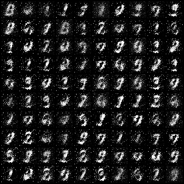
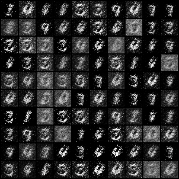

GAN link: https://arxiv.org/pdf/1406.2661
This CGAN is different from original: https://arxiv.org/pdf/1411.1784
Maxout layer is replaced with LeakyRelu and BatchNorm: https://arxiv.org/pdf/1302.4389
SGD is replaced by Adam

## CGAN with MSE: 

## CHAN with BCE:

## Buggy GAN:

After spending 4 + hours, I looked to the reference for hints and compare my implementation:
Acknowledge: https://github.com/eriklindernoren/PyTorch-GAN/blob/master/implementations/cgan/cgan.py
